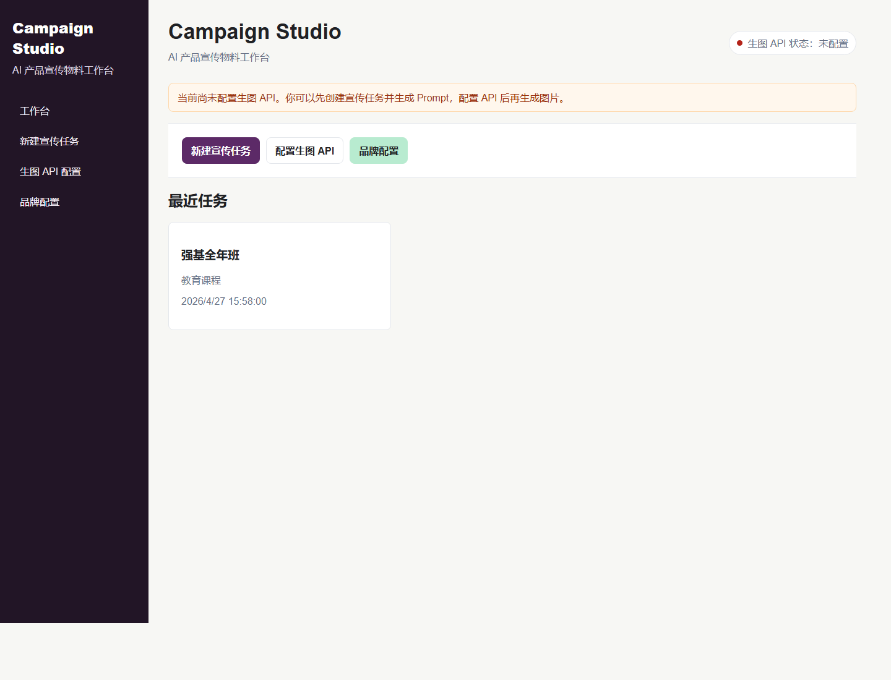
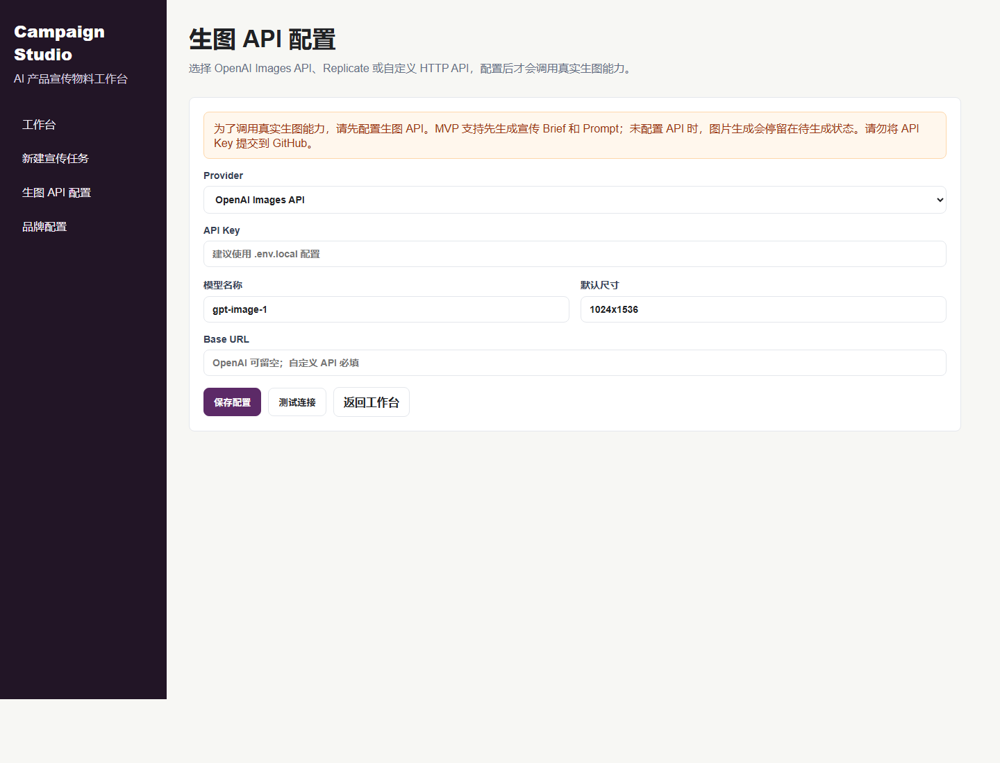
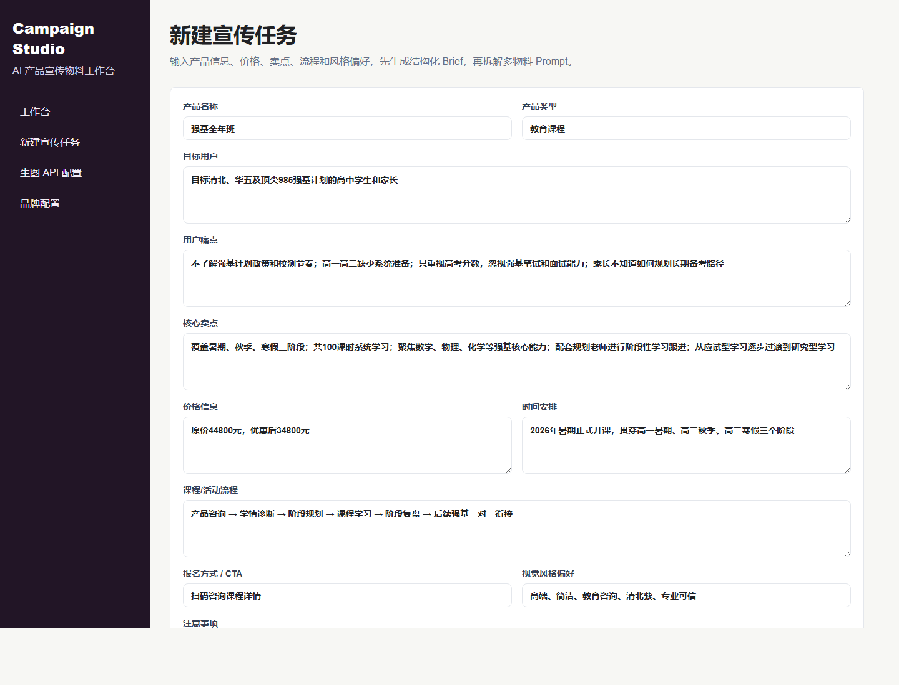
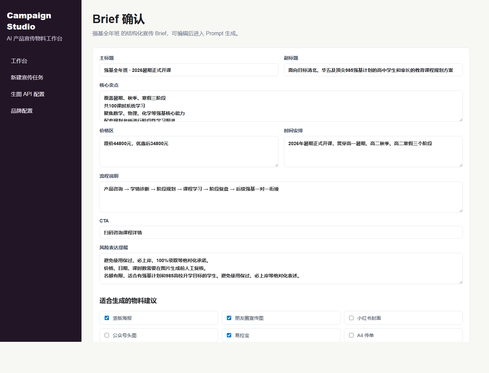
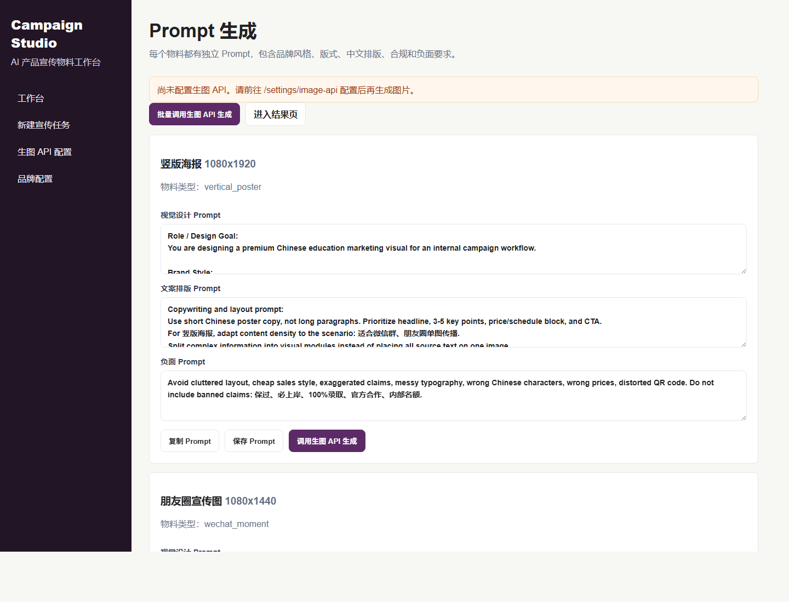
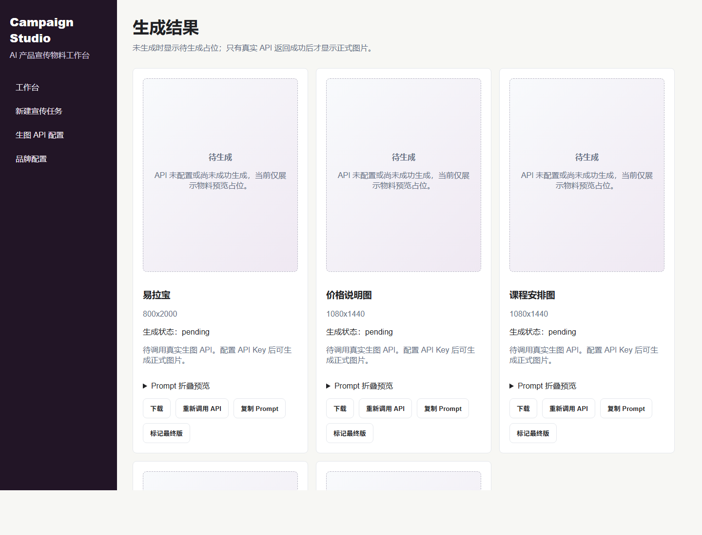

# Campaign Studio

Campaign Studio 是一个面向公司内部产品、运营、市场团队的 **AI 产品宣传物料工作台**。它不是普通的「输入一句 Prompt 生成图片」工具，而是把产品信息、品牌规范、物料拆解和真实生图 API 串成一个可落地的宣传物料生产流程。

系统当前 MVP 已支持：

- 录入产品信息并创建 Campaign
- 自动生成可编辑的结构化宣传 Brief
- 注入品牌风格、禁用宣称和中文排版规则
- 为不同物料生成不同 Prompt
- 配置 OpenAI / Replicate / Custom 生图 API Provider
- 未配置 API Key 时明确阻断正式生图，不返回 mock success
- 进入结果页查看 pending / generating / success / failed / api_not_configured 状态
- 保存 Demo Campaign，便于首次运行后立即体验

> 核心原则：**未配置真实生图 API Key 时，系统只允许生成 Brief 和 Prompt，不会伪造图片生成成功。**

---

## 界面预览

### 工作台首页

首页展示产品入口、API 状态和最近任务。未配置 API 时会明确提示：可以先创建任务和生成 Prompt，配置 API 后再生成正式图片。



### 生图 API 配置

支持 OpenAI Images API、Replicate、自定义 HTTP API。API Key 使用密码输入框，不会在页面中明文回显。



### 新建宣传任务

录入产品名称、用户痛点、卖点、价格、时间、流程、CTA、注意事项、风格偏好，并选择需要生成的物料类型。



### Brief 确认

系统把长文本信息提炼为适合宣传物料使用的短文案结构，避免直接把大段用户输入塞进图片。



### Prompt 工作台

每个物料都有独立 Prompt，包含设计目标、品牌风格、版式、文案、中文排版、合规和负面要求。



### 结果页

未生成时显示“待生成”占位。只有真实 Provider 返回成功后，才会进入 success 状态并展示正式图片。



---

## 产品定位

Campaign Studio 解决的是宣传物料生产中的「信息转译」问题：

```text
产品信息
→ 宣传 Brief
→ 品牌风格注入
→ 多物料拆解
→ 独立生图 Prompt
→ 真实生图 API 调用
→ 结果管理和复核
```

适合生成的物料包括：

- 竖版海报 `1080x1920`
- 朋友圈宣传图 `1080x1440`
- 小红书封面 `1242x1660`
- 公众号头图 `900x383`
- 易拉宝 `800x2000`
- A4 传单
- 课程安排图
- 价格说明图
- 活动流程图

---

## 功能总览

| 模块 | 能力 | 当前状态 |
| --- | --- | --- |
| Campaign 工作台 | 首页、最近任务、API 状态提醒 | 已实现 |
| 生图 API 配置 | OpenAI / Replicate / Custom Provider 表单 | 已实现 |
| Campaign 创建 | 产品信息、风格偏好、物料多选、素材上传入口 | 已实现 |
| Brief 生成 | 标题、副标题、卖点、价格、时间、流程、CTA、风险提醒 | 已实现 |
| Brief 编辑 | 字段级编辑与保存 | 已实现 |
| 品牌配置 | 品牌色、风格、语气、版式习惯、禁用宣称 | 已实现 |
| Prompt 生成 | 不同物料生成不同 Prompt | 已实现 |
| Prompt 操作 | 复制、编辑、保存、单个/批量调用 API | 已实现 |
| 结果页 | 待生成占位、状态展示、复制 Prompt、重新调用 API、标记最终版 | 已实现 |
| OpenAI 生图 | 真实 API 调用结构，支持 URL / base64 结果 | 已实现基础结构 |
| Replicate 生图 | Provider 接口预留 | 待接入模型版本 |
| Custom 生图 | HTTP JSON 接口结构 | 已实现基础结构 |

---

## 技术栈

- **Framework**: Next.js App Router
- **Language**: TypeScript
- **UI**: React + 原生 CSS
- **Database**: SQLite
- **ORM**: Prisma
- **Image Providers**: OpenAI Images API / Replicate / Custom HTTP API
- **Seed Data**: 默认品牌「逐梦清北」与 Demo Campaign「强基全年班」

---

## 快速开始

### 1. 安装依赖

```bash
npm install
```

### 2. 配置环境变量

复制 `.env.example` 为 `.env.local`：

```bash
cp .env.example .env.local
```

Windows PowerShell：

```powershell
Copy-Item .env.example .env.local
```

最小配置：

```env
DATABASE_URL="file:./dev.db"
```

### 3. 初始化数据库

推荐方式：

```bash
npx prisma generate
npx prisma db push
npm run prisma:seed
```

如果本机 Prisma schema engine 在 SQLite `db push` 阶段异常，可使用项目内置兜底脚本初始化同等表结构：

```bash
npm run db:init
npm run prisma:seed
```

### 4. 启动开发服务

```bash
npm run dev
```

访问：

```text
http://localhost:3000
```

---

## 环境变量说明

`.env.local` 示例：

```env
DATABASE_URL="file:./dev.db"

IMAGE_API_PROVIDER=openai
OPENAI_API_KEY=your_openai_api_key
OPENAI_IMAGE_MODEL=gpt-image-1

REPLICATE_API_TOKEN=
REPLICATE_IMAGE_MODEL=

CUSTOM_IMAGE_API_URL=
CUSTOM_IMAGE_API_KEY=
```

字段说明：

| 变量 | 用途 |
| --- | --- |
| `DATABASE_URL` | Prisma SQLite 数据库地址 |
| `IMAGE_API_PROVIDER` | 默认 Provider：`openai` / `replicate` / `custom` |
| `OPENAI_API_KEY` | OpenAI Images API Key |
| `OPENAI_IMAGE_MODEL` | OpenAI 图片模型，默认 `gpt-image-1` |
| `REPLICATE_API_TOKEN` | Replicate Token |
| `REPLICATE_IMAGE_MODEL` | Replicate 模型版本 |
| `CUSTOM_IMAGE_API_URL` | 自定义生图接口 URL |
| `CUSTOM_IMAGE_API_KEY` | 自定义接口 Key |

请勿提交以下内容：

- `.env`
- `.env.local`
- `prisma/dev.db`
- `public/generated`
- API Key 或其他密钥

`.gitignore` 已默认忽略这些文件。

---

## 生图 API 行为

### 未配置 API Key

系统允许：

- 创建 Campaign
- 生成 Brief
- 编辑 Brief
- 生成 Prompt
- 编辑和复制 Prompt
- 进入结果页

系统禁止：

- 返回 mock 成功图
- 把占位图标记为正式生成结果
- 在无 Key 状态下写入 `success`

点击生成图片时会返回：

```text
生图 API 尚未配置，请先前往设置页面配置 API Key。
```

并保存：

```text
status = "api_not_configured"
```

### 配置 API Key 后

系统会通过统一的 `generateImage()` 入口调用真实 Provider：

```ts
async function generateImage(input: GenerateImageInput): Promise<GenerateImageResult>
```

Provider 路由：

```text
openai    → services/image/openai.ts
replicate → services/image/replicate.ts
custom    → services/image/custom.ts
```

---

## OpenAI Images API

环境变量：

```env
IMAGE_API_PROVIDER=openai
OPENAI_API_KEY=your_openai_api_key
OPENAI_IMAGE_MODEL=gpt-image-1
```

实现文件：

```text
services/image/openai.ts
```

处理逻辑：

- 调用 `/v1/images/generations`
- 默认模型为 `gpt-image-1`
- 支持配置 `baseUrl`
- 返回 URL 时直接记录远程 URL
- 返回 `b64_json` 时保存到 `public/generated`

---

## Replicate Provider

环境变量：

```env
IMAGE_API_PROVIDER=replicate
REPLICATE_API_TOKEN=your_replicate_token
REPLICATE_IMAGE_MODEL=your_model_version
```

实现文件：

```text
services/image/replicate.ts
```

当前 MVP 已预留 Provider 结构，但未绑定具体模型版本。接入时需要补充：

- 模型版本
- 输入参数映射
- polling 或 webhook 结果获取
- 输出图片 URL 解析

---

## 自定义 HTTP API

环境变量：

```env
IMAGE_API_PROVIDER=custom
CUSTOM_IMAGE_API_URL=https://your-api.example.com/generate
CUSTOM_IMAGE_API_KEY=your_custom_key
```

请求格式：

```json
{
  "prompt": "full prompt",
  "size": "1080x1920",
  "materialType": "vertical_poster",
  "model": "optional"
}
```

响应格式：

```json
{
  "imageUrl": "https://example.com/generated.png"
}
```

---

## Prompt 生成规则

每个物料的 Prompt 都包含：

1. Role / Design Goal
2. Brand Style
3. Material Type
4. Layout Requirements
5. Text Content
6. Visual Requirements
7. Negative Requirements
8. Chinese Typography Requirements
9. Compliance and Risk Requirements

系统不会简单复用同一个 Prompt，而是按物料场景调整信息密度：

| 物料 | Prompt 重点 |
| --- | --- |
| 朋友圈宣传图 | 信息少、标题强、卖点简洁、适合传播 |
| 易拉宝 | 信息完整、品牌、产品、优势、流程、二维码位 |
| 价格说明图 | 价格、优惠、套餐、报名规则 |
| 课程安排图 | 阶段、时间轴、课时安排 |
| 活动流程图 | 咨询、诊断、规划、学习、复盘流程 |

---

## 默认品牌配置

系统内置默认品牌「逐梦清北」：

```json
{
  "brandName": "逐梦清北",
  "primaryColor": "#5C2A67",
  "secondaryColor": "#B8EBD0",
  "styleKeywords": ["高端", "教育咨询", "清北紫", "简洁大气", "卡片式布局", "高留白", "专业可信"],
  "toneKeywords": ["亲切", "专业", "面向家长", "强调规划", "强调结果导向", "避免夸张承诺"],
  "layoutHabits": ["右下角预留二维码", "标题突出产品名称", "价格信息用卡片呈现", "流程信息用时间轴呈现", "课程表用清晰表格呈现"],
  "bannedClaims": ["保过", "必上岸", "100%录取", "官方合作", "内部名额"]
}
```

页面入口：

```text
/brand
```

---

## 数据模型

Prisma schema 位于：

```text
prisma/schema.prisma
```

核心模型：

- `Campaign`: 宣传任务原始信息和 Brief
- `BrandProfile`: 品牌风格配置
- `ImageApiConfig`: 生图 API Provider 配置
- `PromptPackage`: 每个物料的 Prompt
- `GeneratedAsset`: 生成结果和状态

状态枚举约定：

```text
pending
generating
success
failed
api_not_configured
```

---

## API 路由

| Method | Route | 说明 |
| --- | --- | --- |
| `GET` | `/api/campaigns` | 获取 Campaign 列表 |
| `POST` | `/api/campaigns` | 创建 Campaign |
| `GET` | `/api/campaigns/:id` | 获取 Campaign 详情 |
| `POST` | `/api/campaigns/:id/brief` | 生成或更新 Brief |
| `POST` | `/api/campaigns/:id/prompts` | 生成 Prompt Packages |
| `PATCH` | `/api/campaigns/:id/prompts` | 保存 Prompt 修改 |
| `POST` | `/api/campaigns/:id/generate` | 调用真实生图 API |
| `GET` | `/api/brand` | 获取品牌配置 |
| `POST` | `/api/brand` | 更新品牌配置 |
| `GET` | `/api/settings/image-api` | 获取 API 配置状态 |
| `POST` | `/api/settings/image-api` | 保存 API 配置 |
| `POST` | `/api/settings/image-api/test` | 测试 API 配置状态 |
| `PATCH` | `/api/assets/:id` | 标记或取消最终版 |

---

## 目录结构

```text
app/
  api/
    assets/
    brand/
    campaigns/
    settings/image-api/
  brand/
  campaigns/
  settings/image-api/
components/
docs/images/
lib/
prisma/
services/image/
public/generated/
```

重点文件：

| 文件 | 说明 |
| --- | --- |
| `services/image/index.ts` | 统一生图入口 |
| `services/image/openai.ts` | OpenAI Images API Provider |
| `services/image/replicate.ts` | Replicate Provider 预留 |
| `services/image/custom.ts` | 自定义 HTTP API Provider |
| `lib/brief.ts` | Brief 生成逻辑 |
| `lib/prompt.ts` | Prompt 模板生成逻辑 |
| `lib/materials.ts` | 物料类型与尺寸定义 |
| `lib/defaults.ts` | 默认品牌和 Demo Campaign |
| `prisma/seed.ts` | Demo 数据初始化 |

---

## 推荐验收流程

1. 打开 `/`，确认首页显示 Campaign Studio 和 API 状态。
2. 打开 `/settings/image-api`，保存 OpenAI / Replicate / Custom 配置之一。
3. 在无 API Key 状态下打开 `/campaigns/new` 创建任务。
4. 进入 Brief 页面，确认字段可编辑。
5. 进入 Prompt 页面，确认每个物料有独立 Prompt。
6. 点击复制 Prompt，确认可复制。
7. 在无 API Key 状态下点击生成，确认提示需要配置 API。
8. 打开结果页，确认状态是 `api_not_configured` 或 `pending`，没有 mock success。
9. 配置真实 API Key 后重新生成，确认进入真实调用流程。
10. 执行 `npm run build`，确认 TypeScript 和构建通过。

---

## 常见问题

### 为什么未配置 API Key 时不生成一张示例图？

因为本项目的核心是接入真实生图 API 的工作流。占位图只能表示「待生成」，不能被当作正式结果。

### 页面里保存 API Key 安全吗？

MVP 支持把 API Key 保存到本地数据库，适合本地或内部测试。生产环境建议只使用环境变量或密钥管理服务，不建议把 Key 写入数据库。

### 为什么 Prompt 中强调中文排版？

当前多数图片生成模型仍可能生成错误中文、乱码、错误数字或错误价格。Prompt 会明确要求不要扭曲中文、日期、价格和课时，但正式使用前仍需要人工复核。

### Prisma db push 失败怎么办？

先尝试：

```bash
npx prisma generate
npx prisma db push
```

如果当前机器的 Prisma schema engine 对 SQLite 异常，可使用：

```bash
npm run db:init
npm run prisma:seed
```

---

## Roadmap

- 完整接入 Replicate Provider
- 增加素材上传与素材库管理
- 支持 Logo、二维码、往期海报、产品原型图参与 Prompt 生成
- 增加生成队列和批量重试
- 增加图片成本统计和调用日志
- 增加 Prompt 版本管理
- 增加团队审批流
- 增加 OCR 质检：中文、价格、日期、课时、禁用宣称
- 增加对象存储支持
- 增加部署指南和生产密钥管理方案

---

## License

Internal MVP. 请根据团队实际使用场景补充许可证和商业使用说明。
